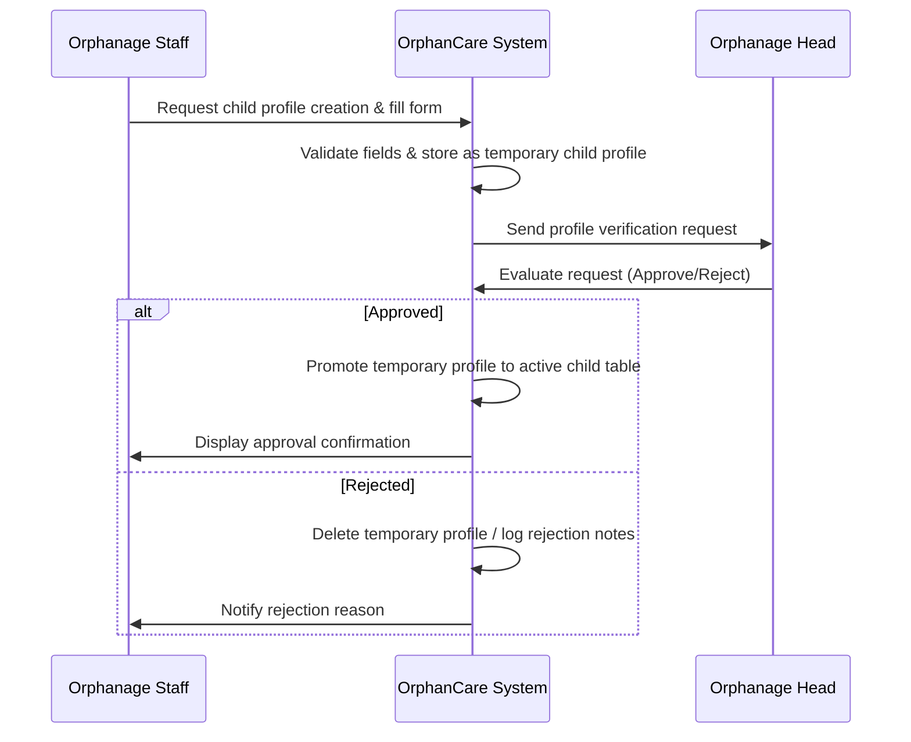

# OrphanCare: Data Privacy Management Information System (MIS) for Child Protection Authority

[](http://51.21.150.105:3000/)
[](https://github.com/Savindugunasekar/Orphanage-Management-System)
[](file:///c:/Users/malin/Desktop/Orphanage-Management-System/docker-compose.yml)
[](file:///c:/Users/malin/Desktop/Orphanage-Management-System/backend/package.json)
[](file:///c:/Users/malin/Desktop/Orphanage-Management-System/adminfrontend/package.json)
[](file:///c:/Users/malin/Desktop/Orphanage-Management-System/backend/prisma/schema.prisma)

**OrphanCare** is a secure, state-of-the-art Management Information System (MIS) designed specifically for the **Child Protection Authority** (e.g., SLCPA). This system replaces outdated paper-based and manual workflows with a comprehensive, privacy-first digital platform. It streamlines orphanage administration, child profiles management, foster/adoption tracking, secure communication, and public engagement while strictly enforcing compliance with data privacy regulations.

---

## 🔗 Key Links

- **Deployment URL**: [OrphanCare Live Application](http://51.21.150.105:3000/)
- **Video Walkthrough**: [System Demo on YouTube](https://www.youtube.com/watch?v=dXaw9w06IsE&t=2s)

---

## 🏛️ System Architecture

OrphanCare is built using a secure **3-tier architecture** that guarantees high availability, security, scalability, and optimal performance:

```
┌────────────────────────────────────────────────────────┐
│                   PRESENTATION LAYER                   │
│         React.js | Tailwind CSS | MUI | DaisyUI        │
└───────────────────────────┬────────────────────────────┘
                            │ (Secure HTTPS REST API / JWT)
┌───────────────────────────▼────────────────────────────┐
│                  BUSINESS LOGIC LAYER                  │
│       Node.js | Express.js | Role-Based Access (RBAC)  │
└───────────────────────────┬────────────────────────────┘
                            │ (Prisma Client ORM)
┌───────────────────────────▼────────────────────────────┐
│                       DATA LAYER                       │
│    PostgreSQL | AWS S3 Storage | AWS CloudWatch Logs    │
└────────────────────────────────────────────────────────┘
```

1. **Presentation Layer (Frontend)**:
   - Built with **React.js** (v18) and styled using **Tailwind CSS**, **DaisyUI**, and **Material UI (MUI)**.
   - Core capabilities: Interactive analytics dashboards, real-time feedback, responsive navigation, web document viewers, and **Agora RTC** integration for secure video conferencing.
2. **Business Logic Layer (Backend)**:
   - Powered by **Node.js** and **Express.js**.
   - Handles authentication/authorization (JWT), custom role-based access control, file/document validators, Stripe payment gateway integration, and workflow orchestration.
3. **Data Layer**:
   - Relational Database: **PostgreSQL** configured and queried via **Prisma ORM**.
   - File/Document Storage: **AWS S3** bucket used for secure storage of highly sensitive records (medical reports, legal papers, birth certificates).
   - Monitoring: **AWS CloudWatch** to track system performance, database operations, and system health.

---

## 🛡️ Data Privacy & Security Focus

As a specialized Data Privacy MIS, OrphanCare integrates industry-standard security features to guarantee the confidentiality and integrity of all child-related records:

- **Strict Role-Based Access Control (RBAC)**: Custom permission levels for Administrators, Orphanage Heads, Staff, Social Workers, and the Public.
- **Two-Factor Access Validation & JWTs**: Secure sign-in utilizing JSON Web Tokens with HTTP-only cookies and automatic session refresh mechanics to prevent token interception.
- **Audited Change Requests**: Orphanage staff cannot directly modify or delete sensitive child profiles; instead, edits are queued as `request` logs which must be explicitly reviewed and approved by the Orphanage Head.
- **Secure File Isolation**: Birth certificates, medical logs, and adoption papers are stored in private AWS S3 buckets. Document links are dynamically generated using S3 pre-signed URLs with short expiration windows to prevent unauthorized resource sharing.

---

## 👥 Roles & Permissions Matrix

The system maps authorization via defined role codes:

| Role | Code | Responsibility |
| :--- | :--- | :--- |
| **System Administrator** | `7788` | Overall system maintenance, orphanage registrations, broadcast messaging, user verification, and analytics audit. |
| **Orphanage Head** | `1910` | Approves or rejects child profile changes, case management oversight, assigns Social Workers, and coordinates local operations. |
| **Orphanage Staff** | `5528` | Direct child care management, requests creation/modification of child records, uploads legal/medical documents. |
| **Social Worker** | `2525` | Schedules foster interviews, tracks case progress, performs suitability reviews, updates home-visit metrics. |
| **General Public / Parent**| `1010` | Browses permitted child information, submits fostering/adoption applications, uploads screening files, processes donations. |

---

## 🔄 Core Workflows

### 1. Child Profile Creation & Verification


### 2. Adoption & Fostering Application
- **Application Submission**: Prospective parents fill out the application details (demographics, NIC, financials, reason for fostering) on the User Dashboard.
- **Document Evaluation**: Uploaded documents (birth, income, marriage certificates) are uploaded to S3.
- **Social Worker Assignment**: System managers assign a social worker to audit the applicant.
- **Multi-Phase Review**: The case progresses through three evaluation phases (Phase 1: Document Check, Phase 2: Interviews/Agreements, Phase 3: Final Legalization).
- **Video Conferencing**: Social workers conduct interviews directly through the built-in Agora RTC platform.

---

## 🗄️ Database Schema Summary

The database uses PostgreSQL configured with the following tables (refer to [schema.prisma](file:///c:/Users/malin/Desktop/Orphanage-Management-System/backend/prisma/schema.prisma)):

- **`users`**: Holds credentials, emails, roles (JSON), verification state, and tokens.
- **`orphanage`**: Profile details, address, capacity, district, and associations.
- **`child`** & **`child_temp`**: Core child demographics, medical, and education records.
- **`child_document`** & **`child_document_temp`**: Secure storage metadata mapped to AWS S3.
- **`application`**: Fostering request particulars.
- **`approvedapplications`**: Approved fostering pairings linking parents, children, and applications.
- **`cases`**: Active case tracking (home visits, scheduled meetings, case status phases).
- **`request`**: Audit logs for creations, updates, and deletions.
- **`donation`**: Log of public donations processed via Stripe.
- **`messages`**: Multi-role messaging threads.
- **`notification`**: User-specific notification logs.

---

## 🚀 Setup & Installation

### Prerequisites
- [Node.js](https://nodejs.org/) (v18 or higher)
- [PostgreSQL](https://www.postgresql.org/) database
- [Docker](https://www.docker.com/) (Optional, for containerized run)

### Environment Setup
Create a `.env` file in the `backend/` directory:
```env
PORT=4000
DATABASE_URL="postgresql://<username>:<password>@<host>:<port>/<dbname>"
ACCESS_TOKEN_SECRET="your_access_token_secret"
REFRESH_TOKEN_SECRET="your_refresh_token_secret"
VERIFY_TOKEN_SECRET="your_verify_token_secret"
BASE_URL="http://localhost:3000"
EMAIL="your_smtp_email@gmail.com"
PASSWORD="your_smtp_app_password"
S3_ACCESS_KEY="your_aws_access_key"
S3_SECRET_ACCESS_KEY="your_aws_secret_key"
S3_BUCKET="your_aws_s3_bucket_name"
STRIPE_SECRET_KEY="your_stripe_secret_key"
```

### Running Locally

#### 1. Setup Backend
```bash
cd backend
npm install
npx prisma generate
npx prisma db push
node index.js
```
*Backend will run on [http://localhost:4000](http://localhost:4000)*

#### 2. Setup Frontend
```bash
cd adminfrontend
npm install
npm start
```
*Frontend will open on [http://localhost:3000](http://localhost:3000)*

---

### Running with Docker

You can run the entire stack (PostgreSQL database, backend server, and frontend client) using Docker Compose:

```bash
docker-compose up --build
```

---

## 🧪 Testing Suite

Quality assurance is performed using a robust testing setup:

- **Unit & Integration Tests**: Implemented using **Jest** and **Vitest** for server functions and database transactions.
- **API Endpoint Tests**: Structured using **Supertest** and monitored with **Postman**.
- **End-to-End Tests**: Selenium WebDriver-driven test cases (`adminfrontend/src/components/__tests__/endToEnd.test.js`) to validate user login flows and authorization redirects.

To execute backend tests:
```bash
cd backend
npm test
```

To execute frontend tests:
```bash
cd adminfrontend
npm test
```

---

## 👥 Development Team

- **Gamage M.S.** (210176F)
- **Gunasekara S.L.** (210194H)
- **Gunathunga W.S.D.** (210196P)

---
*Developed as part of the Child Protection Authority Management Information System initiative (PID:15).*
